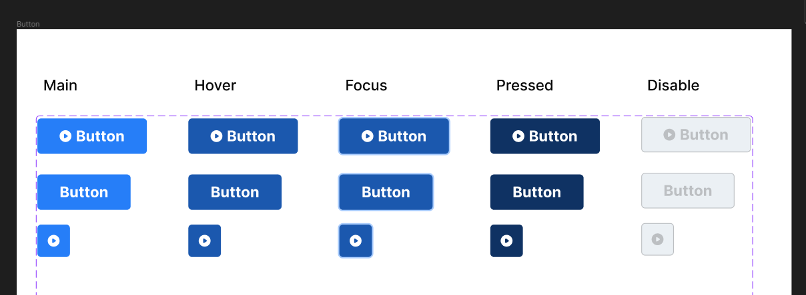
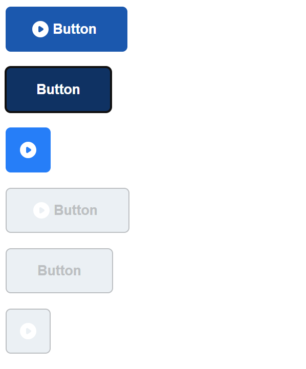

# React 아토믹 컴포넌트 구현

- [React 아토믹 컴포넌트 구현](#react-아토믹-컴포넌트-구현)
  - [Figma](#figma)
  - [React 컴포넌트 구현](#react-컴포넌트-구현)
    - [Button.jsx](#buttonjsx)
    - [이벤트 구현](#이벤트-구현)
      - [data.js](#datajs)

## Figma
[피그마 시안][] => Button


## React 컴포넌트 구현


- 크기 별로 구현
1. Desktop (+ onMouseEnter 이벤트 상태)
2. Tablet (+ onFocus 이벤트 상태)
3. mobile
- 속성별 구현
4. disabled

### Button.jsx
```jsx
import styles from './../styles/Button.module.css'

function Button({Button = "Button", color = styles.main, size = styles.desktop, disabled, ...restProps }) {
  if(disabled) color = styles.disabled;

  if(size === 'tablet') size = styles.tablet;
  else if(size === 'mobile') {
    size = styles.mobile
    Button = null;
  }

  const style = `${color} ${size}`;

  return (
    <button type='button' 
    className={style}
    disabled={disabled}
    {...restProps}>
      {Button}
    </button>
  )
}
```

- `Button.module.css` - `module css`를 사용해, 클래스 이름이 렌더링 시 고유하게 적용되도록 했고, 각 크기, 속성별 스타일을 css 파일에 설정함.
- `<Button size="tablet" />`처럼 size 속성을 전달하고, 조건문으로 size를 파악해 `className`을 구성하고 스타일이 적용되도록 함.
- `<Button disabled />`처럼 disabled 속성을 전달할 경우, 조건문으로 파악해, disabled 스타일이 나타나도록 함.
- 사이즈가 desktop, tablet일 때 `Button` 값이 나오도록 기본값으로 설정하고, 모바일의 경우에만 나타나지 않도록 조건 처리함.
- 이벤트 함수는 전달한 것은 `...restProps`로 받아 실행되도록 함.
- 색상과 사이즈도 기본값을 설정하여, 속성으로 전달하는 내용을 최소화하려 함.

### 이벤트 구현
1. onMouseEnter <-> onMouseLeave
2. onFocus <-> onBlur

```jsx
const root = document.querySelector('#root');

ReactDOM.createRoot(document.getElementById('root')).render(
  <StrictMode>
    <Button  
      onMouseEnter={() => {
        (root.firstChild.style.backgroundColor = color.hover);
      }}
      onMouseLeave={() => {
        (root.firstChild.style.backgroundColor = color.main);
      }}
      onFocus={() => {
        (root.firstChild.style.backgroundColor = color.focus);
      }}
      onBlur={() => {
        (root.firstChild.style.backgroundColor = color.main);
      }}
    />
    {/* ... */}
    <Button size="mobile" disabled />
  </StrictMode>,
)
```

마우스를 버튼에 올리면 배경색이 바뀌고, 내리면 다시 원래 배경색으로 돌아옴.
버튼에 키보드 포커스 시에도 배경색 변경, 포커스가 없어지면 다시 원래 배경색으로 돌아옴.

#### data.js
```js
export const color = {
  main: '#267EF8',
  hover: '#1B58AE',
  focus: '#0F3263',
};
```
색상별 데이터를 객체로 담아 사용

[피그마 시안]: https://www.figma.com/file/UnM4RdA6sLjfCHtuy6Z0ma/Atomic-Design-System-(Community)?type=design&node-id=303%3A5&mode=design&t=xH8If6nLl2hJL0Bl-1