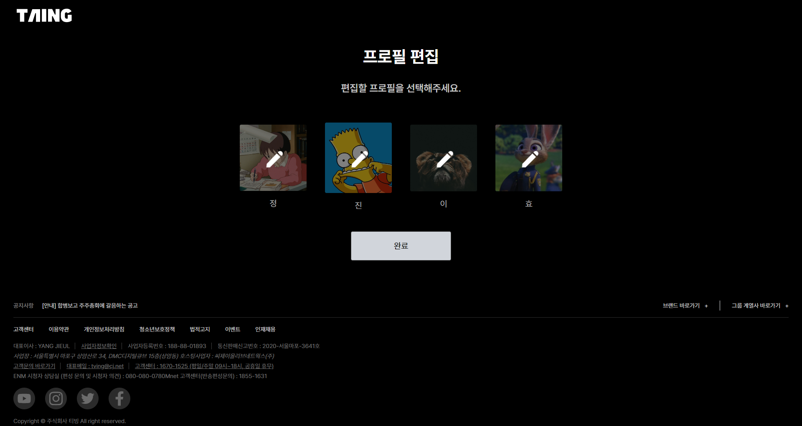
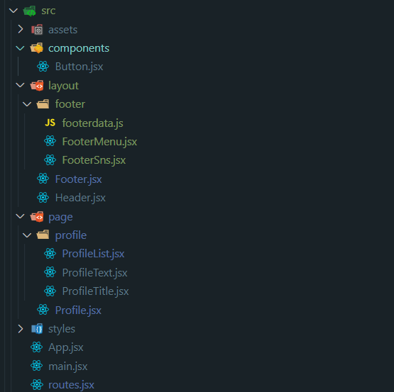

# React 페이지 컴포넌트 구현

- [React 페이지 컴포넌트 구현](#react-페이지-컴포넌트-구현)
  - [구현](#구현)
  - [프로필 페이지](#프로필-페이지)
  - [폴더 구성](#폴더-구성)
  - [JSX](#jsx)

## 구현

[프로필 선택 페이지]

[프로필 편집 페이지]

## 프로필 페이지
Vanilla JS 프로젝트 때 만든 사이트의 프로필 페이지를 React 컴포넌트화하였다.  
기능 구현보다는 컴포넌트화하여 UI 렌더링에 중점을 둘 수 있는 페이지를 선정했으며, 페이지를 컴포넌트로 만들어 유사한 구조의 페이지에 재사용했다. (프로필 선택 페이지 => 프로필 편집 페이지)  
CSS는 tailwind를 사용했다.

## 폴더 구성


logo와 footer의 SNS 이미지 같은 정적 이미지는 `public`에 넣고,  
동적으로 불러오는 프로필 이미지는 `src/assets`에 넣어 불러왔다.  

`layout`에 `Header`, `Footer` 컴포넌트를 만들었고,
아토믹 컴포넌트로 `Button` 컴포넌트를 만들었고,
`page`에서 `Profile 페이지` 컴포넌트를 만들고, 그 안의 요소들을 컴포넌트로 `List`, `Text`, `Title`로 나누었다.  

## JSX
```JSX
//main.jsx
ReactDOM.createRoot(document.getElementById('root')).render(
  <React.StrictMode>
      <RouterProvider router={router} />
  </React.StrictMode>,
)
```

```jsx
//routes.jsx
const router = createBrowserRouter([
  {
    path: '/',
    element: <App />,
    children: [
      { index: true, element: <Profile select /> },
      { path: 'edit', element: <Profile /> },
    ],
  },
]);
```
`react-router-dom`의 `router`를 가져와 `CSR`로 두 개의 페이지를 구현했다.  
선택 페이지를 인덱스 페이지로 두고, 버튼 클릭시 편집 페이지로 이동할 수 있도록 했다.

```jsx
//App.jsx
function App() {
  return (
    <>
      <Header />
      <main>
        <Outlet />
      </main>
      <Footer />
    </>
  );
}
```
`App.jsx` 파일에 `Header`와 `Footer` 컴포넌트를 넣고 `main` 태그를 넣어 레이아웃을 구성했다. `main` 태그 안에 `Router`의 `children`들을 `Outlet`으로 넣었다.

```jsx
//Profile.jsx
export default function Profile({select}) {
  return (
    <section className="mx-auto mb-24 mt-12 w-[70%]">
      <ProfileTitle>프로필 {select ? '선택' : '편집'}</ProfileTitle>
      <ProfileText>{select ? '시청' : '편집'}할 프로필을 선택해주세요.</ProfileText>
      <ProfileList selected={'이'} icon={select ? 'lock' : 'pencil'}></ProfileList>
      {
        select &&
        <NavLink to="/edit"><Button>프로필 편집</Button></NavLink>
      }
      {
        !select &&
        <NavLink to="/"><Button>완료</Button></NavLink>
      }
    </section>
  )
}
```

`Profile 페이지`에서 `Title`, `Text`, `List`, `Button` 컴포넌트를 조립했다.
`router`에서 페이지로 전달하는 `prop`으로 선택 페이지인지 편집 페이지인지 구분하여 렌더링되도록 했다.
버튼도 페이지별로 나누어 현 페이지에 맞게 나타나도록 했고, `NavLink`를 사용해 페이지 간의 이동이 가능하도록 했다.

```jsx
//ProfileList.jsx
//useState, useEffect
  let [list, setList] = useState([]);

  useEffect(() => {
    async function fetchlists() {
      const response = await fetch('/server/db/data.json');
      if(!response.ok) {
        console.log(response.ok)
      }
      const data = await response.json();
      setList(Object.entries(data.users))
    }
    fetchlists();
  }, [])
```

프로필 목록 정보를 갖고 있는 json 파일을 비동기 통신으로 불러와 `useEffect` 훅으로 최초 실행 시 렌더링 되도록 했다.  

```jsx
//ProfileList.jsx
export default function ProfileList({selected, icon}) {

  return (
    <ul className="flex items-center justify-center gap-x-11 pt-11">
      {
        list?.map((item) => { 
          return (
            <li key={item[0]} className="text-gray3">
              <a
                href={`./${icon === 'lock' ? '' : 'edit'}`}
                className="text-gray3"
              >
                <div
                  className="relative duration-500 ease-linear hover:-translate-y-[5%]"
                >
                  
                  <div
                    className={`absolute bottom-0 left-0 right-0 top-0 rounded 
                      ${item[0] !== selected ? 'bg-black/[.5]' : ''}`}
                  >
                    {
                      (icon === 'lock' &&
                      item[0] === selected) || 
                      
                    }
                  </div>
                </div>
                <p className="py-4 text-center text-xl text-gray3">{item[0]}</p>
              </a>
            </li>
          )
        })
      }
    </ul>
  )
}
```

json에서 갖고 온 데이터를 배열로 바꾸어 데이터에 있는 프로필 개수만큼 렌더링 되도록 map을 사용했다.

선택 페이지와 편집 페이지는 이미지를 덮고 있는 아이콘이 다르다. 또 선택 페이지에서 선택된 프로필만 투명도가 0이며, 나머지 프로필에만 자물쇠 아이콘이 있다. 편집 페이지에서는 모든 프로필 이미지에 연필 아이콘이 있다.  

아래와 같은 조건식으로 문제를 해결했다.

```jsx
{
  (icon === 'lock' &&
  item[0] === selected) || 
  
}
```