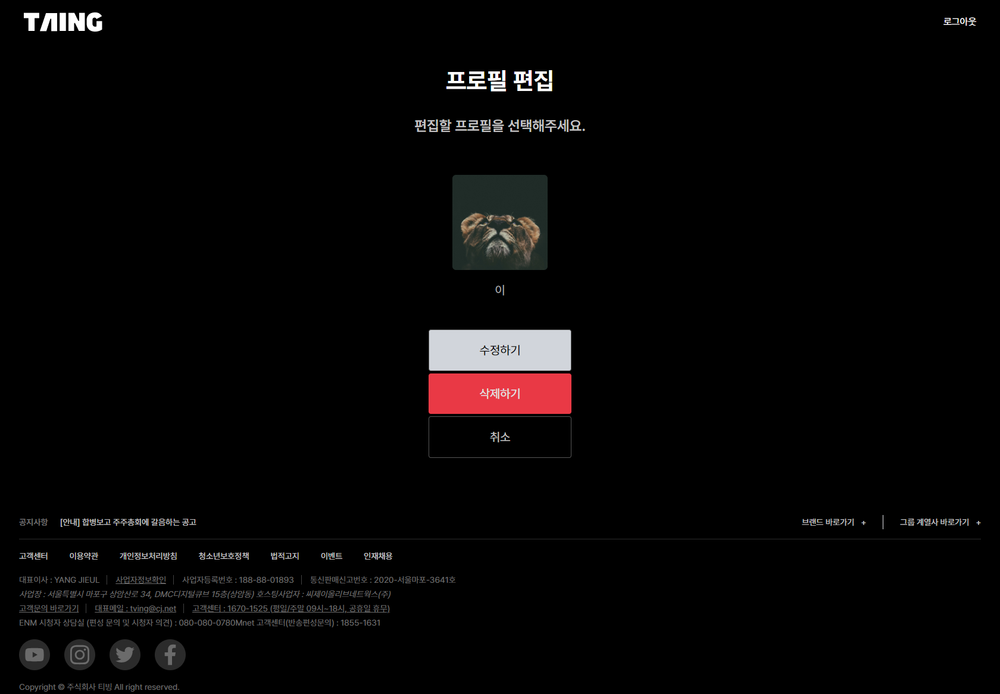

# React 미니 프로젝트

- [React 미니 프로젝트](#react-미니-프로젝트)
  - [구현 결과물](#구현-결과물)
  - [기능 구현](#기능-구현)
  - [구현하고 싶었던 것](#구현하고-싶었던-것)

## 구현 결과물
**[배포 주소][]**

- 로그인
 
- 회원가입

- 프로필 등록

- 프로필 편집

## 기능 구현
- 회원 가입
- 로그인
  - 로그인 시 로그인 페이지, 회원 가입 페이지 접근하지 못하도록 함
  - 로그인해야만 프로필 관련 페이지 접근 가능
- 로그아웃
  - 로그인 시 메뉴 보이도록 함
  - 로그아웃 하면 로그인 페이지로 이동
- 프로필 등록
  - 등록은 최대 4개까지 가능
  - 등록 버튼을 프로필이 4개 이하일 때만 보이게 함
- 프로필 편집(사진, 이름 바꾸기)
  - 편집 페이지로 이동 후 프로필 클릭하면 편집 가능
- 프로필 삭제

## 구현하고 싶었던 것
- 로그인, 회원가입 유효성 검사
  - html minlength로 최소한만 했다.
- 로그인, 회원 가입 시 비밀번호 보이기 기능
- 아이디 당 각각의 프로필 부여
  - 현재는 회원 가입, 로그인만 하면 프로필 공유 상태
- 프로필 생성 시 기본 이미지 제공
  - 이미지까지 넣고 싶지 않은 경우 기본 이미지 제공하면 좋을 듯
- 프로필 편집 시 기존 이미지 가져오기
  - 현재는 이름만 바꾸려고 해도 사진까지 등록해야 수정 가능
- 컴포넌트 나누기
  - 기능 구현만 신경 쓰느라 페이지 컴포넌트를 제외한 재사용을 위한 부분 컴포넌트를 만들지 못했다.
- 메인 페이지
  - 로그인, 회원가입, 프로필 등록, 수정만 가능하고 제공하는 서비스가 없다.
- 백엔드에서 users와 profile 콜렉션 이어주기
  - 한 아이디 당 최대 4개의 프로필 묶고 그 이상 추가되지 않도록 막기
- README 코드 설명...  

이틀에 걸쳐 하기에는 시간이 부족했다는 아쉬움이 있다. 여러 경우의 수를 따지며 디테일하게 구현하고 싶었던 것들은 리액트 프로젝트 때 이어서 구현해야겠다. 한 주 동안 수업에서 배운 것들을 최대한 녹여내려 했다.

[배포 주소]: https://rustandbone.github.io/react-homework/